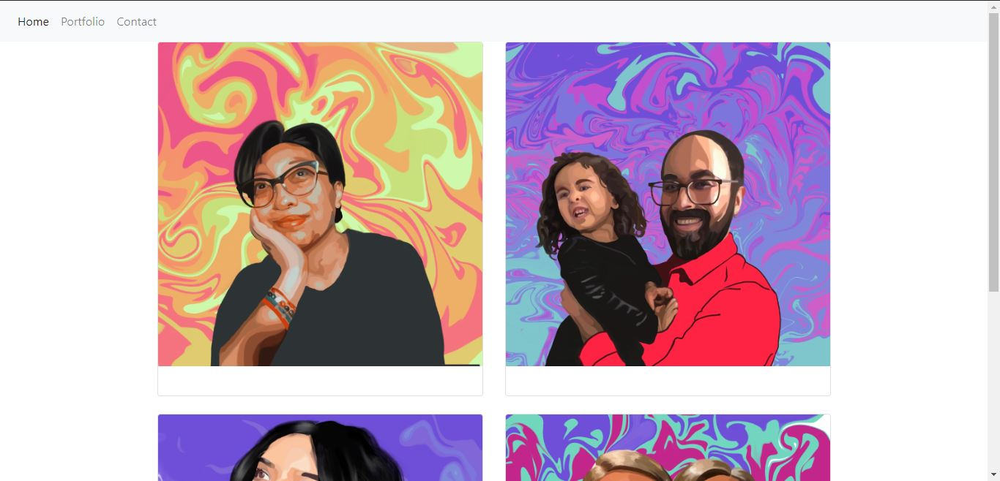

# Homework 2
This project was created to demonstrate understanding of Bootstrap, grid layouts, and interactive layouts. 

## Interactive Layout

Here, is the application on a medium screen. The code indicates margins that is altered in a smaller screen. 
Comparing this to a small screen, the layout is designed to have no margins.

### Other features
This project is also used to demonstrate a proper use of HTML syntax as well as utilizing links.

### Difficulties
I stuggled in linking a custom css file to override the Boostrap file. This is still being problem solved. 

